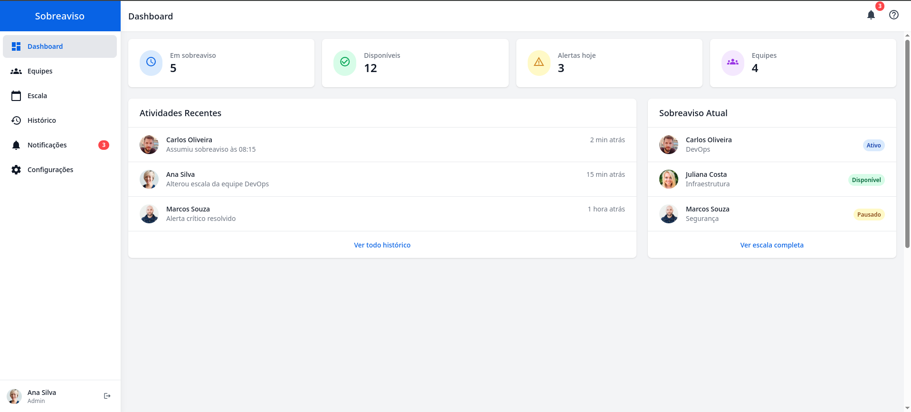

# Sistema de Controle de Sobreaviso (Frontend Demo)

[](https://pedrohenriquebr.github.io/oncall-system/)

 
<!-- Substitua 'images/oncall-system-screenshot.png' pelo caminho real de um bom screenshot -->

## 🚀 Sobre o Projeto

Este repositório contém uma **demonstração de frontend (UI/UX)** para um Sistema de Controle de Sobreaviso. O objetivo é apresentar o design da interface, a experiência do usuário e a estrutura visual planejada para uma aplicação completa de gerenciamento de escalas, equipes e notificações de sobreaviso.

A aplicação completa (não contida neste repositório) visaria resolver desafios comuns no gerenciamento de plantões e sobreavisos, como organização de escalas, comunicação eficiente, rastreamento de histórico e visualização clara do status da equipe.

**Este projeto serve como um exemplo de design de interface e prototipagem frontend.**

## ✨ Demo Ao Vivo

Experimente a interface interativa aqui: 
**[https://pedrohenriquebr.github.io/oncall-system/](https://pedrohenriquebr.github.io/oncall-system/)**

## 🎨 Funcionalidades Demonstradas (UI/UX)

*   **Navegação Principal:** Menu lateral (drawer) para acesso às diferentes seções.
*   **Dashboard:** Layout visual com cards de resumo (status atual, alertas, equipes). Seção de atividades recentes e sobreaviso atual.
*   **Gerenciamento de Equipes:** Tela para listar, buscar e visualizar equipes (com ações de exemplo).
*   **Visualização de Escala:** Layout de calendário para exibir escalas de sobreaviso, com navegação básica de mês. Lista de próximas escalas.
*   **Histórico:** Tabela para visualização de registros passados, com paginação e filtros de exemplo.
*   **Notificações:** Interface para listar notificações recentes de diferentes tipos.
*   **Configurações:** Layout de formulários para configurações de perfil e preferências.
*   **Design Responsivo:** Interface adaptada para diferentes tamanhos de tela (desktop e mobile).

## 💻 Tecnologias Utilizadas (Nesta Demo)

*   **HTML5:** Estrutura semântica da página.
*   **CSS3:** Estilização.
*   **Tailwind CSS:** Framework CSS utilitário para design rápido e consistente.
*   **JavaScript:** Manipulação do DOM, interatividade básica (navegação entre páginas simuladas, abertura/fechamento do drawer).
*   **Material Icons:** Biblioteca de ícones do Google.

## 🚀 Visão da Aplicação Completa (Tecnologias Planejadas)

A intenção seria desenvolver a aplicação completa utilizando:

*   **Backend:** .NET 8 (C#)
*   **Frontend:** Angular 17+ (TypeScript)
*   **Comunicação Real-time:** SignalR
*   **Arquitetura:** CQRS (com MediatR), SOLID Principles
*   **Banco de Dados:** PostgreSQL / SQL Server
*   **ORM:** Entity Framework Core
*   **Outros:** Docker, Azure DevOps/GitHub Actions

## ⚙️ Como Executar Localmente (Esta Demo)

Como este é um projeto frontend estático:

1.  Clone o repositório:
    ```bash
    git clone https://github.com/pedrohenriquebr/oncall-system.git 
    ```
    *(Substitua pelo URL real do seu repositório)*
2.  Navegue até a pasta do projeto:
    ```bash
    cd oncall-system 
    ```
3.  Abra o arquivo `index.html` diretamente no seu navegador.

## 📄 Licença

Este projeto é distribuído sob a licença MIT. Veja o arquivo `LICENSE` para mais detalhes.

## 📬 Contato

Pedro Henrique Braga - [Portfólio](https://pedrohenriquebr.github.io/) | [LinkedIn](https://www.linkedin.com/in/pedrohbr/)
